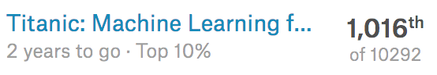

# Titanic: Machine Learning from Disaster

Among the various machine learning / deep-running frameworks, Tensorflow is used to solve the [Binary classification](https://en.wikipedia.org/wiki/Binary_classification) problem of whether the passengers on the Titanic survived or did not survive.

This data set can be downloaded from the [Kaggle](https://www.kaggle.com/c/titanic/data) or this repository.
<table style="float:left;">
    <thead style="font-weight:bold;">
    <tr>
        <td>Variable</td>
        <td>Definition</td>
        <td>Key</td>
    </tr>
    </thead>
    <tbody>
        <tr>
            <td>PassengerId</td>
            <td>Index number</td>
            <td></td>
        </tr>
        <tr>
            <td>survival</td>
            <td>Survival</td>
            <td>0 = No, 1 = Yes</td>
        </tr>
        <tr>
            <td>pclass</td>
            <td>Ticket class</td>
            <td>1 = 1st, 2 = 2nd, 3 = 3rd</td>
        </tr>
         <tr>
            <td>sex</td>
            <td>Sex</td>
            <td></td>
        </tr>
        <tr>
            <td>Age</td>
            <td>Age in years</td>
            <td></td>
        </tr>
        <tr>
            <td>sibsp</td>
            <td># of siblings / spouses aboard the Titanic</td>
            <td></td>
        </tr>
        <tr>
            <td>parch</td>
            <td># of parents / children aboard the Titanic</td>
            <td></td>
        </tr>
        <tr>
            <td>ticket</td>
            <td>Ticket number</td>
            <td></td>
        </tr>
        <tr>
            <td>fare</td>
            <td>Passenger fare</td>
            <td></td>
        </tr>
        <tr>
            <td>cabin</td>
            <td>Cabin number</td>
            <td></td>
        </tr>
        <tr>
            <td>embarked</td>
            <td>Port of Embarkation</td>
            <td>C = Cherbourg, Q = Queenstown, S = Southampton</td>
        </tr>
    </tbody>
</table>

## Requirements

- python (a 2.x release at least 2.7.14)

- tensorflow (1.6.0)

- functools32 (3.2.3.post2)

- pandas (0.22.0)

- numpy (1.14.1)

## How to run

1. Run <code>python preprocessing.py</code> to preprocess data.
2. Run <code>python train.py</code> to train preprocessed data.
3. Run <code>python test.py</code> to create the submission file.

## Submission result

The highest score was 80.382, ranking in the top 10%.

{:width="300px"}

## References

- [Lecture by Professor Sung Kim for Machine Learning](https://hunkim.github.io/ml/)
- [Titanic solution for minsuk heo](https://github.com/minsuk-heo/kaggle-titanic/blob/master/titanic-solution.ipynb)
- [Titanic top 4 with ensemble modeling](https://www.kaggle.com/yassineghouzam/titanic-top-4-with-ensemble-modeling)
- [Introduction to ensembling stacking in python](https://www.kaggle.com/arthurtok/introduction-to-ensembling-stacking-in-python)
- [Heaton Research (The Number of Hidden Layers)](http://www.heatonresearch.com/2017/06/01/hidden-layers.html)
- [Tensorflow Guide: Batch Normalization](http://ruishu.io/2016/12/27/batchnorm/)
- [Why is it better to use Softmax function than sigmoid function](https://www.quora.com/Why-is-it-better-to-use-Softmax-function-than-sigmoid-function)
- [A Comprehensive Guide to Data Exploration](https://www.analyticsvidhya.com/blog/2016/01/guide-data-exploration/)
- [Handle missing data](https://measuringu.com/handle-missing-data/)
